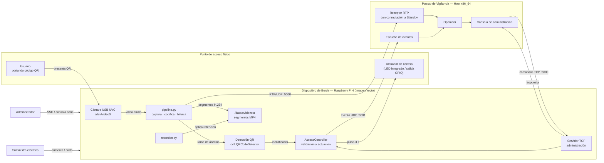
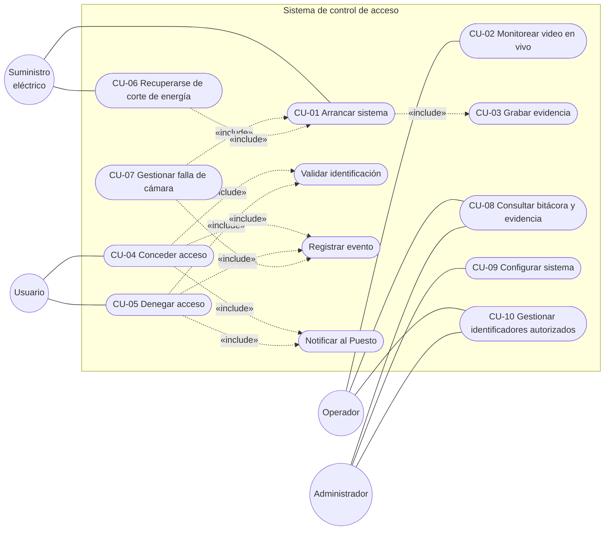
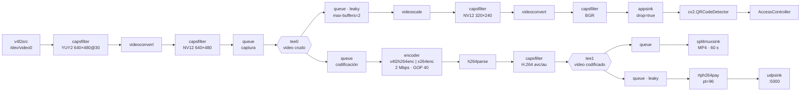
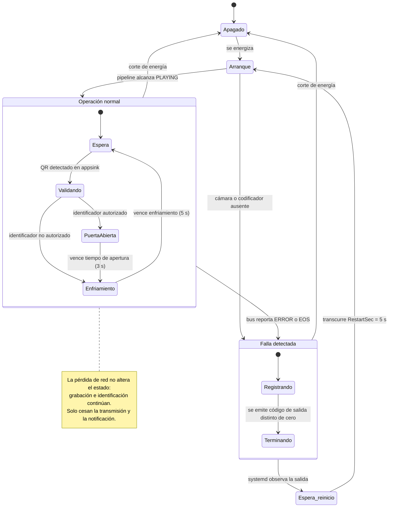
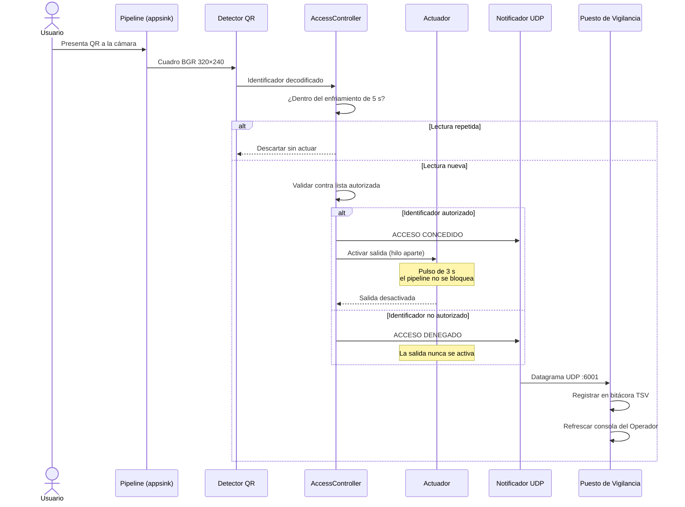

# Documento de Ingeniería de Requisitos

**Proyecto:** Sistema Embebido de Control de Acceso con Video
**Institución:** Instituto Tecnológico de Costa Rica
**Curso:** EL5841 Taller de Sistemas Embebidos
**Profesor:** Dr. Ing. Johan Carvajal Godínez
**Integrantes:** Luis Diego García Rojas · José Eduardo Tencio Solano

---

## 0. Propósito y alcance

El anteproyecto definió el sistema dejando dieciocho parámetros técnicos abiertos (etiquetas `[P-01]` a `[P-18]`), a resolver durante la implementación. Este documento **cierra esos parámetros** con los valores efectivamente adoptados, **revisa los requisitos** a la luz de las decisiones tomadas y **documenta las desviaciones** respecto al anteproyecto junto con su justificación.

La numeración de casos de uso (CU-xx), requisitos funcionales (RF-xx) y no funcionales (RNF-xx) se mantiene idéntica a la del anteproyecto para conservar la trazabilidad. Los requisitos añadidos durante la implementación se numeran a partir de RF-18.

---

## 1. Solución implementada

El sistema se implementó como una **arquitectura distribuida de dos nodos**, en lugar del nodo único que suponía el anteproyecto:

| Nodo | Plataforma | Responsabilidad |
|---|---|---|
| **Dispositivo de Borde** | Raspberry Pi 4 (8 GB) con imagen Linux construida con Yocto Project | Captura, codificación, grabación de evidencia, retención, identificación por QR, actuación y transmisión |
| **Puesto de Vigilancia** | Host Linux x86_64 | Recepción y despliegue del video, bitácora de eventos recibidos y consola de administración remota |

La comunicación entre ambos emplea tres flujos independientes:

| Flujo | Transporte | Puerto | Sentido | Contenido |
|---|---|---|---|---|
| Video en vivo | RTP sobre UDP | 5000 | Borde → Puesto | H.264 empaquetado (`rtph264pay`) |
| Administración | TCP | 6000 | Puesto → Borde (petición/respuesta) | `REG:`, `DEL:`, `LIST`, `PING` |
| Notificación de eventos | UDP | 6001 | Borde → Puesto | Texto de evento de acceso y de estado |

### Módulos de software

| Módulo del anteproyecto | Artefacto implementado | Observación |
|---|---|---|
| `main` | `app_borde.py` | Integra supervisión, servidor TCP y arranque del pipeline |
| `pipeline` | `pipeline.py` | Grafo construido con `Gst.ElementFactory`, sin `gst-launch` embebido |
| `acceso` | `AccessController` en `app_borde.py` | Validación contra conjunto persistido en JSON |
| `actuador` | `AccessController._init_actuator` / `actuate` | Tres estrategias: LED por sysfs, GPIO físico, simulación |
| `bitacora` | `RetentionLog` + `ReceiverLog` + journald | Bitácora repartida entre los dos nodos (ver desviación D-05) |
| `retencion` | `retention.py` | Módulo independiente, sin dependencia de GStreamer |
| `config` | Variables de entorno + `config/usuarios_autorizados.json` | Ver desviación D-06 |
| — | `puesto_vigilancia.py` | Nodo nuevo, no previsto en el anteproyecto |

---

## 2. Cierre de los parámetros abiertos

| ID | Parámetro | **Valor adoptado** | Justificación de la decisión |
|---|---|---|---|
| **P-01** | Cámara e interfaz | **Cámara USB UVC vía `v4l2src`** sobre `/dev/video0` | Es el hardware disponible en el laboratorio. Evita la dependencia de `libcamera`/`libcamera-gst` y, con ello, reduce el tamaño de la imagen. La capa propia incorpora `kernel-module-uvcvideo` y conserva un grupo de paquetes CSI opcional, activable con la variable `CAMARA = "csi"`. |
| **P-02** | Resolución | **640 × 480 (VGA)** en captura y grabación; **320 × 240** en la rama de análisis | VGA basta para identificar a una persona en el encuadre cercano de una puerta y mantiene la carga de `videoconvert` por software dentro de lo que la Pi 4 sostiene junto con la codificación. La rama de análisis se reduce a QVGA porque la detección de QR no requiere más y así se descarga el detector de OpenCV. |
| **P-03** | Tasa de cuadros | **30 fps solicitados; ~20 fps efectivos** | La cámara anuncia YUY2 640×480@30. La conversión YUY2 → NV12 por software impone el límite real medido de ≈20 fps, que sigue dentro del rango de vigilancia aceptable definido en el anteproyecto (10–30 fps). |
| **P-04** | Códec | **H.264.** En la Pi: `v4l2h264enc` (hardware). En el host: `x264enc` (software) | La Pi 4 no codifica H.265 por hardware. El perfil de codificación es el **único** punto del grafo que cambia entre plataformas, lo que constituye la garantía de portabilidad del diseño. |
| **P-05** | Tasa de bits y control | **2 Mbps**, GOP de **40 cuadros (≈2 s a 20 fps)** | 2 Mbps a VGA da margen de calidad holgado y produce segmentos predecibles para dimensionar el disco. El GOP de 2 s acota el tiempo que un receptor tardío espera por un cuadro clave sin disparar la tasa de bits. |
| **P-06** | Contenedor de grabación | **MP4** mediante `splitmuxsink` | Se escoge por compatibilidad universal de reproducción. Se asume conscientemente su desventaja —el segmento abierto pierde el átomo `moov` ante un corte abrupto— y se compensa reduciendo P-07 (ver desviación D-03). |
| **P-07** | Duración de segmento | **60 s** | Acota la pérdida máxima de evidencia ante un corte de energía a un minuto. A la tasa medida, un segmento ocupa ≈10 MB, lo que mantiene manejable la cantidad de archivos en la partición de datos. |
| **P-08** | Política de retención | **Por porcentaje de disco:** se dispara bajo **15 %** libre y borra los segmentos más antiguos hasta recuperar **25 %** | El criterio por porcentaje se adapta solo al tamaño del medio, a diferencia del criterio por antigüedad. Se verifica cada 60 s. Dos clases de archivo quedan **protegidas**: el segmento actualmente en escritura y todo segmento con marcador `.event`. |
| **P-09** | Protocolo de transmisión | **RTP sobre UDP**, puerto 5000, envío directo a IP fija | Es la opción de menor latencia y la más simple de desplegar para un único receptor conocido. Se descarta RTSP porque el escenario no requiere varios clientes ni descubrimiento de sesión. |
| **P-10** | Latencia objetivo | **Sub-segundo** (objetivo ≤ 500 ms extremo a extremo) | Se consigue con `tune=zerolatency` en el perfil de host, GOP corto, `sync=false` en el `udpsink` y una cola con descarte (`leaky`) exclusivamente en la rama de red. |
| **P-11** | Mecanismo de identificación | **Código QR de texto plano estático**, detectado con `cv2.QRCodeDetector` sobre la rama de análisis del pipeline | Opción no contemplada en el anteproyecto (ver desviación D-01). No requiere hardware adicional, reutiliza la cámara ya presente y mantiene la interfaz del módulo `acceso` reemplazable. Se exige QR estático: los generadores de QR dinámicos codifican una URL en vez del identificador. |
| **P-12** | Tiempo de apertura | **3 s**, configurable | Dentro del rango 1–10 s del anteproyecto. Se añade un **tiempo de enfriamiento de 5 s** por código para evitar reactivaciones mientras el QR permanece frente a la cámara. |
| **P-13** | Comportamiento sin energía | **Fail-secure por construcción** | El actuador se energiza únicamente durante el pulso; sin alimentación la salida queda inactiva y la puerta cerrada. En la demostración el actuador es el LED integrado de la Pi (sysfs), no una cerradura real: la etapa de potencia queda fuera del alcance entregado (ver desviación D-04). |
| **P-14** | Formato de bitácora | **Texto plano delimitado por tabuladores (TSV)**, complementado con **journald** | TSV es legible sin herramientas, se escribe en modo de anexado (resistente a cortes) y se filtra con utilidades estándar. journald recoge además la salida del servicio y el historial de reinicios. |
| **P-15** | Esquema de almacenamiento | **Tres particiones** en la microSD: `/boot` (vfat, 100 MB), `/` (ext4) y **`/data` (ext4, 4 GB)** para evidencia | Separar los datos del sistema evita que la retención o un disco lleno comprometan el arranque. Definido en `control-acceso.wks`; el directorio `/data/evidencia` lo crea `tmpfiles.d` al arrancar. Se descarta el rootfs de solo lectura por complejidad frente al alcance del curso. |
| **P-16** | Tiempo de arranque objetivo | **≤ 60 s** desde energizado hasta pipeline en estado PLAYING | Coherente con el rango del anteproyecto. Medición concreta a reportar en la demostración. |
| **P-17** | Versión de Yocto | **Poky / Scarthgap 5.0.20 (LTS)**, kernel 6.6.63, GStreamer 1.22.12 | Rama LTS con soporte vigente en `meta-raspberrypi` y en `meta-openembedded` para todos los plugins requeridos. Todas las capas se fijan a la misma rama. |
| **P-18** | Acceso de administración | **SSH (dropbear) + consola serie** (`ENABLE_UART = "1"`), más el **canal TCP de aplicación en el puerto 6000** | SSH para diagnóstico sin monitor, consola serie como respaldo cuando la red no está disponible. La administración de usuarios autorizados no requiere sesión interactiva: se hace por el canal de aplicación desde el Puesto de Vigilancia. |

---

## 3. Requisitos funcionales (revisados)

Columna **Estado**: `Cumplido` · `Cumplido con variante` (se satisface el propósito por un mecanismo distinto al previsto) · `Alcance reducido`.

| ID | Requisito (texto final) | Estado | Realización en la implementación |
|---|---|---|---|
| **RF-01** | El sistema deberá iniciar la aplicación automáticamente al arrancar, sin intervención humana. | Cumplido | Unidad `control-acceso.service` con `SYSTEMD_AUTO_ENABLE = "enable"` y `WantedBy=multi-user.target`. |
| **RF-02** | El sistema deberá capturar video de una cámara USB UVC a 640×480 y 30 fps solicitados. | Cumplido | `v4l2src` sobre `/dev/video0` con `capsfilter` de YUY2 640×480@30. |
| **RF-03** | El sistema deberá codificar el video en H.264 a 2 Mbps con GOP de 40 cuadros. | Cumplido | `v4l2h264enc` con `extra-controls` en la Pi; `x264enc` en el host. El resto del grafo es idéntico. |
| **RF-04** | El sistema deberá transmitir el video en vivo mediante RTP sobre UDP al puerto 5000 del Puesto de Vigilancia. | Cumplido | `rtph264pay` (`config-interval=1`, `pt=96`) y `udpsink`. |
| **RF-05** | El sistema deberá grabar el video en segmentos MP4 de 60 s de forma continua. | Cumplido | `splitmuxsink` con `max-size-time` y callback `format-location` que nombra cada archivo con marca de tiempo y número de fragmento. |
| **RF-06** | El sistema deberá aplicar una política de retención por porcentaje de disco libre (umbral 15 %, objetivo 25 %) para no agotar el almacenamiento. | Cumplido | `RetentionPolicy` en hilo propio, con revisión cada 60 s y registro de cada borrado. |
| **RF-07** | La transmisión y la grabación deberán ser independientes: la falla de una no deberá detener la otra. | Cumplido | Bifurcación con `tee` tras el codificador, con una `queue` por rama. La rama de red usa `leaky=downstream` para descartar antes que ejercer contrapresión; las ramas de captura y codificación **no** usan descarte, porque perder cuadros arbitrarios corrompería el flujo H.264 grabado. |
| **RF-08** | El sistema deberá recibir eventos de identificación mediante la lectura de códigos QR presentados a la cámara. | Cumplido con variante | Rama de análisis del `tee` previo al codificador → `appsink` → `cv2.QRCodeDetector`. |
| **RF-09** | El sistema deberá validar cada evento contra una lista de identificadores autorizados y decidir si concede o deniega el acceso. | Cumplido | Conjunto en memoria protegido por cerrojo, persistido en `config/usuarios_autorizados.json`. |
| **RF-10** | Ante un acceso concedido, el sistema deberá activar la salida durante 3 s y luego desactivarla. | Cumplido | Pulso ejecutado en hilo propio para no bloquear el hilo de video; serializado con cerrojo para impedir activaciones solapadas. |
| **RF-11** | Ante un acceso denegado, la salida deberá permanecer inactiva. | Cumplido | La rama de denegación solo emite la notificación de evento; no toca el actuador. |
| **RF-12** | El sistema deberá registrar cada evento (acceso, denegación, falla, reinicio) con marca de tiempo. | Cumplido | Eventos de acceso notificados por UDP y registrados en el Puesto; retención y errores del Borde en journald y en la bitácora de retención. |
| **RF-13** | Tras un corte de energía, el sistema deberá reanudar la operación y conservar la evidencia previa. | Cumplido | Arranque automático por systemd; evidencia en partición `/data` independiente del rootfs; pérdida máxima acotada a un segmento (60 s). |
| **RF-14** | El sistema deberá detectar la pérdida de la cámara, registrarla y restablecer la operación automáticamente. | Cumplido con variante | **No se reconstruye el pipeline dentro del proceso.** El bus de GStreamer detecta `ERROR`/`EOS`, se registra la causa y el proceso termina con código distinto de cero; `Restart=on-failure` con `RestartSec=5` lo relanza limpio. Ver desviación D-02. |
| **RF-15** | ~~El control de acceso deberá seguir operando aunque la cámara o la red fallen.~~ **Texto revisado:** el control de acceso deberá seguir operando aunque **la red** falle. La pérdida de la cámara inhabilita necesariamente la identificación. | Alcance reducido | **Conflicto arquitectónico declarado.** Ver desviación D-01. Ante caída de red: la grabación y la identificación continúan sin interrupción; solo se pierde la transmisión y la notificación de eventos, ambas por UDP y sin acuse. |
| **RF-16** | El sistema deberá permitir consultar la bitácora y los segmentos grabados. | Cumplido con variante | Consulta fuera de línea: bitácora TSV en el Puesto (`logs/receptor_vigilancia.log`), journald y segmentos en `/data/evidencia` del Borde, accesibles por SSH. No existe interfaz de consulta remota desde la consola de administración. |
| **RF-17** | Los parámetros de operación deberán ser configurables sin recompilar la imagen. | Cumplido | Variables de entorno (`STREAM_HOST`, `STREAM_PORT`, `ADMIN_PORT`, `EVENT_PORT`, `DEVICE`, `PERFIL`, `EVIDENCIA`) declaradas en la unidad de systemd; lista de usuarios en archivo JSON en la partición de datos, modificable en caliente. |

### Requisitos añadidos durante la implementación

| ID | Requisito | Origen | Prioridad |
|---|---|---|---|
| **RF-18** | El sistema deberá permitir al Operador **registrar y eliminar** identificadores autorizados de forma remota, sin reiniciar el servicio ni abrir sesión interactiva en el Borde. | CU-09 | Alta |
| **RF-19** | Los cambios en la lista de identificadores autorizados deberán **persistir** en el medio de almacenamiento y sobrevivir a un reinicio del servicio o del equipo. | CU-09 | Alta |
| **RF-20** | El Borde deberá **notificar al Puesto de Vigilancia** cada evento de acceso en el instante en que ocurre, de forma independiente del flujo de video. | CU-04, CU-05 | Media |
| **RF-21** | El Puesto de Vigilancia deberá **detectar la ausencia de flujo de video** y conmutar automáticamente a una señal de respaldo identificable («SIN SEÑAL»), reenganchando solo al restablecerse la transmisión. | CU-02 | Media |
| **RF-22** | El Puesto de Vigilancia deberá **verificar la conectividad** con el Borde bajo demanda del Operador. | CU-08 | Baja |

---

## 4. Requisitos no funcionales y restricciones (revisados)

| ID | Requisito | Valor adoptado | Estado |
|---|---|---|---|
| **RNF-01** | La imagen deberá construirse de forma reproducible con Yocto a partir de las capas del proyecto. | Scarthgap 5.0.20 LTS; todas las capas en la misma rama; build dentro del contenedor `crops/poky:ubuntu-22.04`; `local.conf` y `bblayers.conf` del build validado versionados en `yocto/conf/usado/`. | Cumplido |
| **RNF-02** | La imagen deberá incluir solo los paquetes necesarios. | Receta de imagen propia con grupos de paquetes separados por área (`base`, `video`, `csi`, `gpio`, `debug`); el grupo CSI se instala condicionalmente según la variable `CAMARA`; de `plugins-bad` solo se instala `videoparsersbad`. | Cumplido |
| **RNF-03** | El tiempo de arranque hasta operación deberá mantenerse dentro del objetivo. | ≤ 60 s. | Cumplido |
| **RNF-04** | La latencia de la transmisión en vivo deberá mantenerse dentro del objetivo. | Sub-segundo. | Cumplido |
| **RNF-05** | El sistema deberá tolerar cortes de energía sin corromper el sistema de archivos. | Evidencia en partición `/data` ext4 separada; segmentos de 60 s; cierre ordenado del pipeline mediante envío de EOS y espera en el bus antes de pasar a NULL, para que `splitmuxsink` escriba correctamente el átomo `moov`. | Cumplido |
| **RNF-06** | El accionamiento eléctrico deberá aislar la Raspberry Pi de la carga de la cerradura. | **No aplica al entregable:** el actuador es el LED integrado de la Pi. La abstracción del actuador deja preparada la ruta GPIO para una etapa de potencia futura. | Fuera de alcance (D-04) |
| **RNF-07** | La imagen de producción no deberá incluir accesos de depuración sin contraseña. | `EXTRA_IMAGE_FEATURES = "debug-tweaks"` debe retirarse de `local.conf` para la configuración de producción; la imagen entregada es de **desarrollo** y lo conserva deliberadamente para la demostración. | Declarado, no aplicado |
| **RNF-08** | El módulo de identificación deberá ser reemplazable sin modificar el resto de la aplicación. | `AccessController.process_qr_code` recibe una cadena de identificador; la fuente de esa cadena (QR, RFID, botón, comando de red) es sustituible sin tocar validación, actuación ni registro. | Cumplido |
| **RNF-09** | *(nuevo)* El grafo multimedia deberá construirse elemento por elemento, sin descripciones textuales de pipeline embebidas. | `Gst.ElementFactory.make` y enlace explícito en `pipeline.py`; permite manejo de errores por elemento y consulta de propiedades en tiempo de ejecución. | Cumplido |
| **RNF-10** | *(nuevo)* El canal de administración remota carece de autenticación y cifrado. | **Limitación declarada:** cualquier equipo con alcance de red al puerto 6000 puede alterar la lista de autorizados. Mitigación asumida: operación en red local aislada. Una versión de producción requeriría autenticación y transporte cifrado. | Limitación conocida |

---

## 5. Desviaciones respecto al anteproyecto

### D-01 — El mecanismo de identificación pasó a depender de la cámara

El anteproyecto planteó cuatro opciones para `[P-11]`: botón en GPIO, comando por red, RFID y reconocimiento facial. Se adoptó una quinta: **lectura de códigos QR sobre el flujo de la cámara**.

La decisión aprovecha hardware ya presente y elimina la necesidad de un lector adicional, pero tiene una **consecuencia arquitectónica que debe declararse**: las tres primeras opciones del anteproyecto eran independientes del subsistema de video, y por eso RF-15 podía exigir que el control de acceso sobreviviera a una falla de cámara. Con identificación por QR esa independencia **no existe**: si se pierde la cámara, se pierde la capacidad de identificar.

**Resolución adoptada:** se reescribe RF-15 restringiéndolo a la falla de red, y se compensa con RF-14 reforzado —detección de la falla y reinicio automático en ≤ 5 s—, de modo que la ventana de indisponibilidad del control de acceso quede acotada en vez de eliminada. El canal TCP de administración (RF-18) sigue operativo durante esa ventana, de forma que el Operador conserva control sobre la lista de autorizados aunque no haya video.

### D-02 — Recuperación por reinicio del proceso, no por reconstrucción del pipeline

El anteproyecto (CU-07) describía reintentos periódicos de apertura de la cámara dentro del proceso en ejecución. Se optó por **terminar el proceso con código distinto de cero y delegar el reinicio a systemd**.

Fundamento: reconstruir un pipeline de GStreamer tras perder `/dev/videoN` deja estado residual en los elementos y en los descriptores del dispositivo, y es más frágil que un arranque limpio. El gestor de servicios ya provee política de reinicio, respaldo temporal y registro de intentos, de modo que reimplementar eso en la aplicación duplicaría funcionalidad del sistema operativo. El resultado observable para el usuario es equivalente —la operación se restablece sola— y el tiempo de indisponibilidad queda fijado por `RestartSec=5`.

### D-03 — MP4 en lugar de un contenedor tolerante a cortes

El anteproyecto señalaba en `[P-06]` que Matroska y MPEG-TS son más robustos ante cortes abruptos. Se escogió **MP4** por compatibilidad de reproducción, asumiendo que el segmento abierto es irrecuperable si el equipo pierde energía antes de escribir el átomo `moov`.

**Compensación:** `[P-07]` se fijó en 60 s en vez de un valor del orden de los minutos, acotando la pérdida máxima a un minuto de evidencia. Adicionalmente, el cierre ordenado de la aplicación envía EOS y espera confirmación en el bus antes de destruir el pipeline, de modo que un apagado controlado **no** pierde ningún segmento.

### D-04 — La etapa de potencia quedó fuera del alcance

`[P-13]` y RNF-06 describen relé, optoacoplador y diodo de protección. El entregable usa el **LED integrado de la Raspberry Pi por sysfs** como actuador, con la ruta de GPIO físico implementada pero sin carga real conectada.

La abstracción del actuador contempla tres estrategias seleccionadas en tiempo de ejecución —LED por sysfs, GPIO físico, y simulación en el perfil de host—, de modo que conectar una etapa de potencia real no requiere modificar la lógica de control de acceso. El comportamiento fail-secure se conserva: la salida solo se energiza durante el pulso.

### D-05 — Arquitectura de dos nodos y bitácora repartida

El anteproyecto modelaba un sistema de un solo nodo con un cliente de video genérico en el extremo remoto. La implementación introduce el **Puesto de Vigilancia como aplicación propia** (`puesto_vigilancia.py`), lo que añade RF-18 a RF-22.

Consecuencia sobre `[P-14]`: la bitácora no es única. Los eventos de acceso se registran en el **Puesto** (porque es donde los recibe el Operador), mientras que las acciones de retención y los errores del pipeline se registran en el **Borde**. Para una revisión forense completa hay que consultar ambos. Se acepta esta división porque corresponde a la separación real de responsabilidades entre los dos nodos, pero se documenta explícitamente como limitación.

### D-06 — Configuración por variables de entorno en lugar de archivo de configuración

El anteproyecto preveía un módulo `config` que cargara parámetros desde un archivo externo. Se implementó mediante **variables de entorno declaradas en la unidad de systemd**, salvo la lista de identificadores autorizados, que sí reside en un archivo JSON.

Fundamento: las variables de entorno en la unidad son el mecanismo nativo del gestor de servicios, quedan versionadas junto con la receta y evitan añadir un analizador de configuración a la aplicación. RF-17 se satisface: cambiar el destino de transmisión o el directorio de evidencia no requiere reconstruir la imagen, solo editar la unidad y recargar systemd.

---

## 6. Matriz de trazabilidad (CU × RF) actualizada

| | RF-01 | RF-02 | RF-03 | RF-04 | RF-05 | RF-06 | RF-07 | RF-08 | RF-09 | RF-10 | RF-11 | RF-12 | RF-13 | RF-14 | RF-15 | RF-16 | RF-17 | RF-18 | RF-19 | RF-20 | RF-21 | RF-22 |
|---|---|---|---|---|---|---|---|---|---|---|---|---|---|---|---|---|---|---|---|---|---|---|
| CU-01 | ● | | | | | | | | | | | | | | | | | | | | | |
| CU-02 | | ● | ● | ● | | | ● | | | | | | | | | | | | | | ● | |
| CU-03 | | ● | ● | | ● | ● | ● | | | | | | | | | | | | | | | |
| CU-04 | | | | | | | | ● | ● | ● | | ● | | | | | | | | ● | | |
| CU-05 | | | | | | | | ● | ● | | ● | ● | | | | | | | | ● | | |
| CU-06 | ● | | | | | | | | | | | ● | ● | | | | | | ● | | | |
| CU-07 | | | | | | | | | | | | ● | | ● | ● | | | | | | ● | |
| CU-08 | | | | | | | | | | | | | | | | ● | | | | | | ● |
| CU-09 | | | | | | | | | | | | | | | | | ● | ● | ● | | | |

---

## 7. Matriz de verificación

| Requisito | Método | Procedimiento | Criterio de aceptación |
|---|---|---|---|
| RF-01, RF-13 | Demostración | Cortar y restablecer la alimentación de la Pi sin intervenir el teclado. | El servicio vuelve a estado activo y el pipeline alcanza PLAYING sin intervención, dentro de P-16. |
| RF-02, RF-03 | Inspección + análisis | `v4l2-ctl --list-formats-ext` y reproducción de un segmento verificando códec y resolución. | Segmento H.264 reproducible a 640×480. |
| RF-04, RF-10 (P-10) | Medición | Encuadrar un cronómetro en marcha y fotografiar simultáneamente la escena y la pantalla del Puesto. | Diferencia inferior a 1 s. |
| RF-05, RF-07 | Demostración | Operar 5 min continuos y listar `/data/evidencia`. | Segmentos consecutivos de ≈60 s, todos reproducibles, sin huecos. |
| RF-06 | Prueba | Llenar artificialmente la partición de datos por encima del umbral. | Se borran los segmentos más antiguos; los marcados `.event` y el segmento en escritura sobreviven; cada borrado queda registrado. |
| RF-07 | Prueba | Desconectar el cable de red del Puesto durante 60 s. | La grabación no se interrumpe; la transmisión se reanuda al reconectar. |
| RF-08, RF-09, RF-11 | Demostración | Presentar un QR autorizado y uno no autorizado. | Autorizado: actuador pulsa 3 s y se notifica «ACCESO CONCEDIDO». No autorizado: actuador inactivo y se notifica «ACCESO DENEGADO». |
| RF-10 (P-12) | Medición | Cronometrar el pulso del actuador. | 3 s ± tolerancia. |
| RF-12, RF-16 | Inspección | Revisar la bitácora del Puesto y `journalctl -u control-acceso` tras las pruebas anteriores. | Toda prueba ejecutada tiene su entrada con marca de tiempo. |
| RF-14, RF-15 | Prueba | Desconectar la cámara USB en caliente durante la operación. | Se registra el error, el servicio se reinicia solo, y al reconectar la cámara la operación se restablece sin intervención. El canal TCP responde a `PING` durante la indisponibilidad. |
| RF-17 | Prueba | Cambiar `STREAM_HOST` en la unidad de systemd, recargar y reiniciar el servicio. | El flujo llega a la nueva dirección sin reconstruir la imagen. |
| RF-18, RF-19 | Demostración | Registrar un usuario desde el Puesto, reiniciar el Borde y consultar la lista. | El usuario registrado persiste tras el reinicio y concede acceso. |
| RF-20 | Demostración | Presentar un QR con el video en marcha. | La notificación aparece en el Puesto en el mismo instante que el pulso del actuador. |
| RF-21 | Demostración | Detener la aplicación del Borde con el Puesto en operación. | El Puesto conmuta a «SIN SEÑAL» en menos de 3 s y reengancha al relanzar el Borde. |
| RF-22 | Demostración | Ejecutar la opción PING desde la consola del Puesto. | Respuesta `OK: PONG`. |
| RNF-01 | Análisis | Construir la imagen desde cero en otra máquina siguiendo `docs/YOCTO.MD`. | La imagen resultante arranca y presenta el mismo conjunto de paquetes. |
| RNF-02 | Inspección | Revisar el manifiesto de paquetes de la imagen. | Ausencia de grupos no requeridos; el grupo CSI no aparece con `CAMARA = "usb"`. |
| RNF-08 | Análisis | Revisión de código de la frontera entre detección e identificación. | Sustituir la fuente del identificador no requiere tocar validación, actuación ni registro. |

---

## 8. Diagramas revisados

Los diagramas del anteproyecto se actualizan aquí para reflejar la arquitectura efectivamente construida. Cada uno indica a cuál diagrama original sustituye.

### 8.1 ConOps revisado

> Sustituye al diagrama ConOps de la sección 1.1. Cambios: el sistema pasa a ser de **dos nodos**; el mecanismo de identificación deja de ser un bloque independiente y se absorbe dentro del subsistema de video; la administración deja de ser una vía exclusiva del Administrador y se convierte en un canal de aplicación operado desde el Puesto.

### 8.2 Casos de uso revisado

> Sustituye al diagrama de la sección 1.2. Cambios: se añade **CU-10** (gestión remota de identificadores) porque RF-18 y RF-19 no tenían caso de uso propio; el Operador pasa a ser actor de CU-09 y CU-10; CU-07 deja de incluir reintento interno y pasa a incluir CU-01 por la vía del reinicio de servicio.

### 8.3 Pipeline de video implementado

> **Sustituye al diagrama de la sección 4.1**, que es el más desactualizado del anteproyecto. El anteproyecto preveía un único `tee` posterior al codificador. La implementación usa **dos niveles de bifurcación**: el primero sobre video crudo, para alimentar la detección de QR sin volver a decodificar; el segundo sobre el flujo ya codificado, para compartir una sola codificación entre disco y red (alternativa A de la tabla de decisiones de arquitectura).

**Justificación de las políticas de cola:** la rama de análisis y la rama de red usan `leaky=downstream` porque en ambas es preferible descartar un cuadro antiguo que frenar el grafo —un QR se vuelve a leer en el cuadro siguiente, y un paquete RTP perdido no corrompe la grabación—. Las ramas de captura y codificación **no** usan descarte: perder cuadros arbitrarios dentro del codificador rompería el flujo H.264 almacenado como evidencia, de modo que ahí se prefiere la contrapresión.

### 8.4 Modos y estados de operación revisados

> Sustituye al diagrama de la sección 3.1. Cambio principal: desaparece el estado «Operación degradada» con reintento interno. La falla de cámara o de codificador conduce a terminación del proceso y relanzamiento por systemd (D-02). La pérdida de red **no** es un cambio de estado del Borde: la aplicación sigue en operación normal y los sockets UDP continúan emitiendo sin acuse.

### 8.5 Secuencia de acceso concedido revisada

> Sustituye al diagrama de la sección 3.1. Cambios: el origen del evento es la rama de análisis del propio pipeline, no un módulo externo; se añade la notificación al Puesto y la escritura en su bitácora; la actuación ocurre en un hilo separado para no bloquear el flujo de video.

### 8.6 Descomposición funcional revisada

> Sustituye al diagrama de la sección 3.2. Se añaden F1.6 (análisis de la rama cruda), F3.3 (notificación al Puesto), F5.3 (gestión remota de identificadores) y F6 (funciones propias del Puesto de Vigilancia, inexistentes en el anteproyecto).

```mermaid
flowchart TD
    F0["F0 Controlar acceso con video"]

    F0 --> F1["F1 Gestionar video"]
    F0 --> F2["F2 Controlar acceso"]
    F0 --> F3["F3 Registrar y notificar"]
    F0 --> F4["F4 Supervisar y recuperar"]
    F0 --> F5["F5 Administrar sistema"]
    F0 --> F6["F6 Monitorear en el Puesto"]

    F1 --> F11["F1.1 Capturar"]
    F1 --> F12["F1.2 Codificar"]
    F1 --> F13["F1.3 Transmitir"]
    F1 --> F14["F1.4 Grabar segmentos"]
    F1 --> F15["F1.5 Aplicar retención"]
    F1 --> F16["F1.6 Derivar rama de análisis"]

    F2 --> F21["F2.1 Detectar e interpretar QR"]
    F2 --> F22["F2.2 Validar identificación"]
    F2 --> F23["F2.3 Accionar salida"]
    F2 --> F24["F2.4 Aplicar enfriamiento"]

    F3 --> F31["F3.1 Escribir registro local"]
    F3 --> F32["F3.2 Consultar registros"]
    F3 --> F33["F3.3 Notificar evento al Puesto"]

    F4 --> F41["F4.1 Arranque automático"]
    F4 --> F42["F4.2 Detectar fallas en el bus"]
    F4 --> F43["F4.3 Terminar y delegar reinicio"]

    F5 --> F51["F5.1 Configurar parámetros"]
    F5 --> F52["F5.2 Actualizar imagen"]
    F5 --> F53["F5.3 Gestionar identificadores"]

    F6 --> F61["F6.1 Recibir y desplegar video"]
    F6 --> F62["F6.2 Conmutar a Standby"]
    F6 --> F63["F6.3 Recibir eventos"]
    F6 --> F64["F6.4 Emitir comandos de administración"]
```

### 8.7 Asignación de funciones a requisitos (actualizada)

| Función | Requisitos cubiertos |
|---|---|
| F1.1 Capturar | RF-02 |
| F1.2 Codificar | RF-03 |
| F1.3 Transmitir | RF-04, RF-07 |
| F1.4 Grabar segmentos | RF-05, RF-07 |
| F1.5 Aplicar retención | RF-06 |
| F1.6 Derivar rama de análisis | RF-08 |
| F2.1 Detectar e interpretar QR | RF-08 |
| F2.2 Validar identificación | RF-09 |
| F2.3 Accionar salida | RF-10, RF-11 |
| F2.4 Aplicar enfriamiento | RF-10 |
| F3.1 / F3.2 Registrar y consultar | RF-12, RF-16 |
| F3.3 Notificar evento al Puesto | RF-20 |
| F4.1 Arranque automático | RF-01, RF-13 |
| F4.2 / F4.3 Detectar y delegar reinicio | RF-14, RF-15 |
| F5.1 Configurar | RF-17 |
| F5.3 Gestionar identificadores | RF-18, RF-19 |
| F6.1 Recibir y desplegar video | RF-04 |
| F6.2 Conmutar a Standby | RF-21 |
| F6.3 Recibir eventos | RF-12, RF-20 |
| F6.4 Emitir comandos de administración | RF-18, RF-22 |
